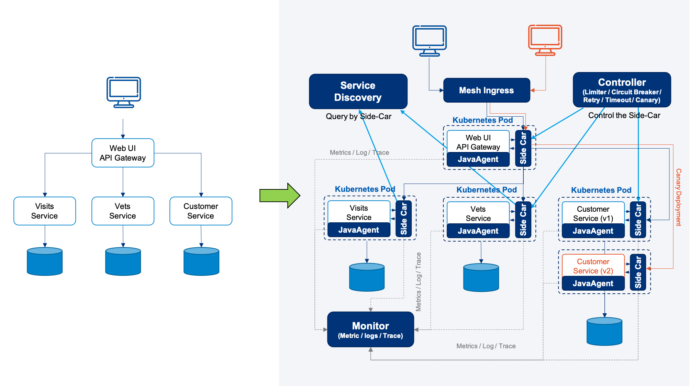
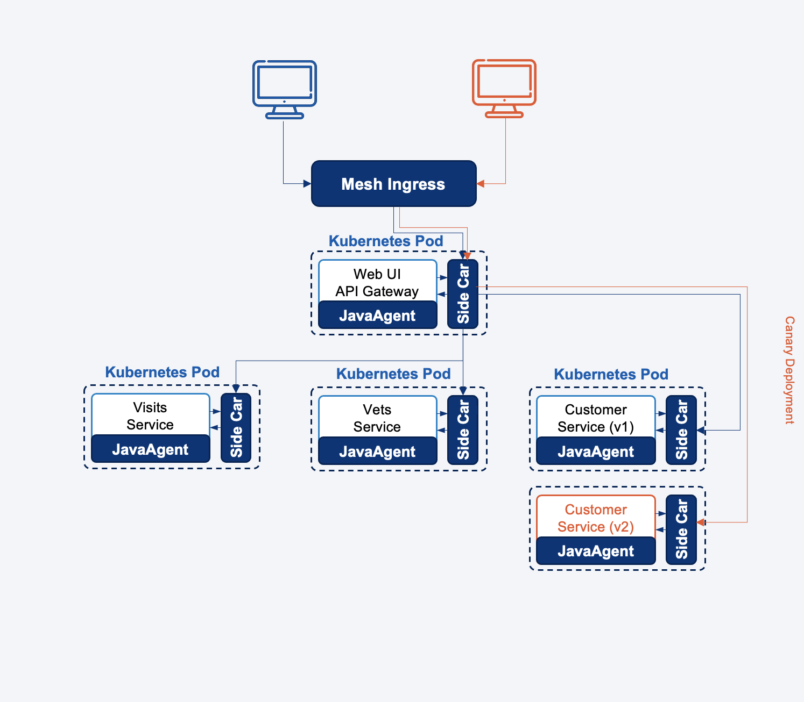

# Easemesh
A service mesh implementation for connecting, secure, control, and observe services of spring-cloud.

## Overview 
### Purpose && Principles
* Fill the gap between Java Spring-Cloud and Service mesh 
* No-intrusive
* Microservices governance enhancement

### Architecture Diagram
* 
### Features
* Zero-code modification for Java Spring-Cloud application migration, only small configuration update needed.
* Compatible with popular Java Spring-Cloud ecosystem's Service register/discovery（Eureka/Consul/Nacos)
* Canary Deployment
* Resilience (Timeout/CircuitBreaker/Retryer/Limiter)
* Observability(Metrics/Tracing/Log)

## Quick Start
#### Environment require
##### Infrastructure version
* Linux kernel version 4.15+
* Kubernetes version 1.18+
* Mysql version 14.14+
#####  Dependence check
1. Run cmd `kubectl get nodes` to make sure your k8s cluster is healthy. 
2. Run cmd `mysql -u$your_db_user -p$your_db_pass` to make sure application can connect to db successfully. 

### Installation
```
cd ./install
./egctl mesh install
```
* It will register K8s mesh-deployment CRD, and start Easemesh control-plane, IngressGateway.
1. Run cmd to check Control plane and ingress gateway's status 
```
ubuntu ~ |>kubectl get pod mesh-ingress-${random-suffix}   
NAME              READY  STATUS  RESTARTS  AGE
mesh-ingress-${random-suffix}  1/1   Running  0     18h

ubuntu ~ |>kubectl get pod easegateway-cluster-0-${random-suffix}
NAME              READY  STATUS  RESTARTS  AGE
easegateway-cluster-0-${random-suffix}  1/1   Running  0     18h

ubuntu ~ |>kubectl get pod easegateway-cluster-1-${random-suffix}
NAME              READY  STATUS  RESTARTS  AGE
easegateway-cluster-1-${random-suffix}  1/1   Running  0     18

ubuntu ~ |>kubectl get pod easegateway-cluster-2-${random-suffix}
NAME              READY  STATUS  RESTARTS  AGE
easegateway-cluster-2-${random-suffix}  1/1   Running  0     18
```
2. Run cmd to check CRD's successfully registration
```
ubuntu ~ |>kubectl get crd |grep meshdeployment              
meshdeployments.mesh.megaease.com       2021-03-18T02:54:15Z
```
### Examples 
#### Overview
* SprintCloud PetClinic  [github link](https://github.com/spring-petclinic/spring-petclinic-cloud) micro service example.
* It uses Spring Cloud Gateway, Spring Cloud Circuit Breaker, Spring Cloud Config, Spring Cloud Sleuth, Resilience4j, Micrometer and Eureka Service Discovery from Spring Cloud Netflix technology stack.




##### Start PetClinic in Easemesh with K8s:

1. Enter `./example/mesh-app-petclinic` dir, execute `./install.sh `
2. Using the db table schemes and records provided in [PetClinic example](https://github.com/spring-projects/spring-petclinic/tree/main/src/main/resources/db/mysql) to set up yours.
3. Run `kubectl get svc mesh-ingress `
Easemesh will create a k8s `NodePort` type service for Easemesh IngressGateway. Configure it into your traffic gateway's routing address,e.g., configure NGINX with
```
location /pet/ {
        proxy_pass http://$NodePortIP:$NodePortNum/;
            ...
}

```
4. Open browser with `$your_domain/pet/#!/welcome`, should see the welcome page of the PetClinic website. 

### Canary deployment



1. Colored your traffic with HTTP header `X-Canary: lv1`. This can be done by using Chrome browser's **ModHeader** plugin. If users visit the PetClinic website with desired HTTP header, Easemesh will route it into the Customer service's canary version. 
2. Developing a canary version of Customer service, which adds an  extra process to the city field of the customer data. The change can be checked via [this commitment](https://github.com/akwei/spring-petclinic-cloud/commit/3be54a2c7e63c955990cbc1e78dab029b516a3ec)
3. Deploy it with cmd `kubectl apply -f  ./example/mesh-app-petclinic/canary/customers-service-deployment-canary.yaml`
4. Open chrome with `$your_domain/pet/#!/owners`, the owner info page remained the same.
5. Enable colored traffic from step 1, and visit the same URL again. Should see the table with brand new city field which will be added "-US" suffix into every record. 

